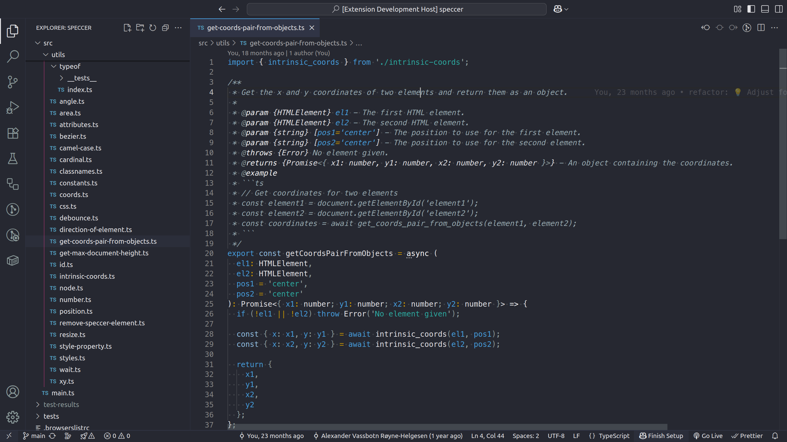

# Accessible (AA) Theme<!-- omit from toc -->

A pair of **accessible, high-contrast VS Code themes** designed for readability, clarity, and reduced eye strain.  
This theme family includes both **Dark** and **Light** variants, tuned for **WCAG AA accessibility**. Based on the article [Accessible syntax highlight theme](https://phun-ky.net/2023/10/06/accessible-syntax-highlight-theme).

## Table of Contents<!-- omit from toc -->

- [Features](#features)
- [Palette](#palette)
- [Installation](#installation)
- [Usage](#usage)
- [Accessibility](#accessibility)
- [Contributing](#contributing)
- [License](#license)
- [Changelog](#changelog)
- [Sponsor me](#sponsor-me)

## Features

- Carefully balanced color palette with consistent contrasts
- Distinct hues for:
  - Keywords, variables, constants, and operators
  - Brackets, parentheses, and punctuation
  - Functions, methods, and object properties
  - Classes, types, and module references
  - Strings, numbers, symbols, and regex
- Markdown support (headings, code blocks, links, emphasis)
- Git status decorations and terminal ANSI colors
- WCAG AA contrast ratio for editor and UI elements
- Bracket pair highlighting colors optimized for quick scanning

## Palette

Core colors used across both dark and light variants:

| Color            | Hex       | Ratio   | Normal Text | Large Text |
| ---------------- | --------- | ------- | ----------- | ---------- |
| Arona            | `#859BA3` | 5.04:1  | AA          | AAA        |
| Vivid Amber      | `#C79500` | 5.4:1   | AA          | AAA        |
| Sea Kale         | `#2CAAA0` | 5.14:1  | AA          | AAA        |
| Flax Flower Blue | `#469EDD` | 5.03:1  | AA          | AAA        |
| Boredom          | `#8C9B9B` | 5.08:1  | AA          | AAA        |
| Lilac Mist       | `#E4E4E7` | 11.57:1 | AAA         | AAA        |
| Pompelmo         | `#FF6666` | 5.13:1  | AA          | AAA        |
| Distance         | `#566D71` | 5.07:1  | AA          | AAA        |
| Ground Earth     | `#806200` | 5.29:1  | AA          | AAA        |
| Advantageous     | `#1E766D` | 5.01:1  | AA          | AAA        |
| Jazz Blue        | `#1D699F` | 5.43:1  | AA          | AAA        |
| Mountain Pass    | `#5C6A6A` | 5.21:1  | AA          | AAA        |
| Black            | `#000000` | 19.4:1  | AAA         | AAA        |
| Rebellion Red    | `#CD0404` | 5.36:1  | AA          | AAA        |

## Installation

1. Open **Extensions** in VS Code (`Ctrl+Shift+X` / `⌘+Shift+X`)
2. Search for **Accessible (AA) Themes**
3. Install and select either:
   - **Accessible (AA) Dark**
   - **Accessible (AA) Light**

## Usage

Once installed, open the **Command Palette** (`Ctrl+Shift+P` / `⌘+Shift+P`) and run: `Preferences: Color Theme`

Select **Accessible (AA) Dark** or **Accessible (AA) Light**.

## Accessibility

- Meets **WCAG AA contrast standards** for text and UI
- Designed to be legible for long coding sessions
- Balanced bracket colors for better nesting visibility
- Comments are distinguishable without being distracting

## Contributing

Want to contribute? Please read the
[CONTRIBUTING.md](https://github.com/phun-ky/vscode-accessible-theme/blob/main/CONTRIBUTING.md)
and
[CODE_OF_CONDUCT.md](https://github.com/phun-ky/vscode-accessible-theme/blob/main/CODE_OF_CONDUCT.md)

## License

This project is licensed under the MIT License - see the
[LICENSE](https://github.com/phun-ky/vscode-accessible-theme/blob/main/LICENSE) file for
details.

## Changelog

See the
[CHANGELOG.md](https://github.com/phun-ky/vscode-accessible-theme/blob/main/CHANGELOG.md) for
details on the latest updates.

## Sponsor me

I'm an Open Source evangelist, creating stuff that does not exist yet to help
get rid of secondary activities and to enhance systems already in place, be it
documentation or web sites.

The sponsorship is an unique opportunity to alleviate more hours for me to
maintain my projects, create new ones and contribute to the large community
we're all part of :)

[Support me on GitHub Sponsors](https://github.com/sponsors/phun-ky).

p.s. **Ukraine is still under brutal Russian invasion. A lot of Ukrainian people
are hurt, without shelter and need help**. You can help in various ways, for
instance, directly helping refugees, spreading awareness, putting pressure on
your local government or companies. You can also support Ukraine by donating
e.g. to [Red Cross](https://www.icrc.org/en/donate/ukraine),
[Ukraine humanitarian organisation](https://savelife.in.ua/en/donate-en/#donate-army-card-weekly)
or
[donate Ambulances for Ukraine](https://www.gofundme.com/f/help-to-save-the-lives-of-civilians-in-a-war-zone).
